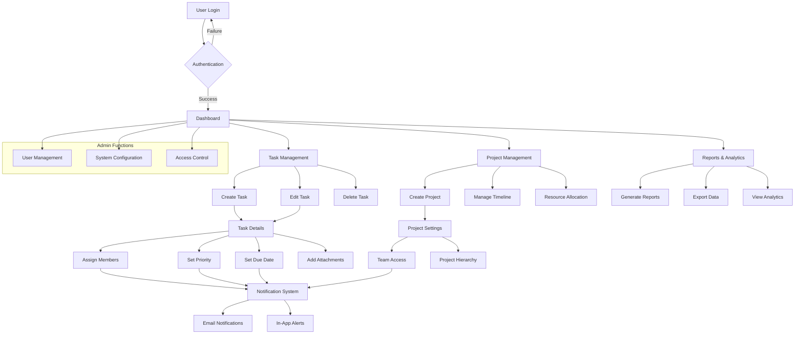
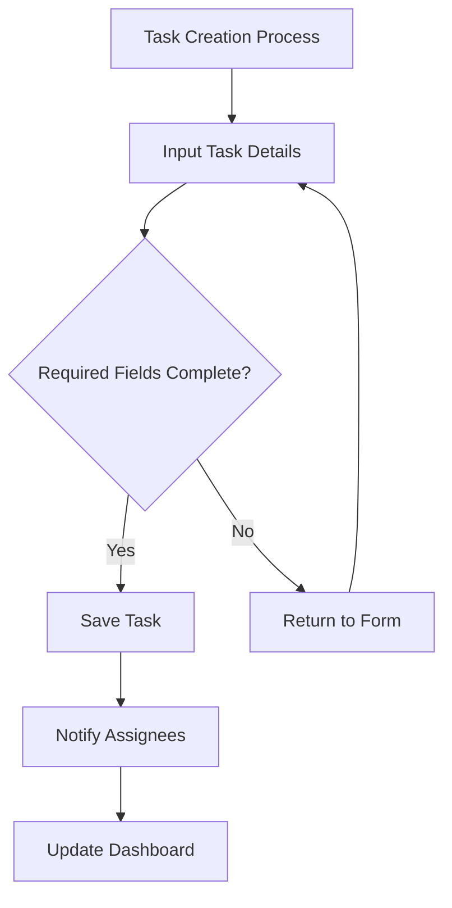
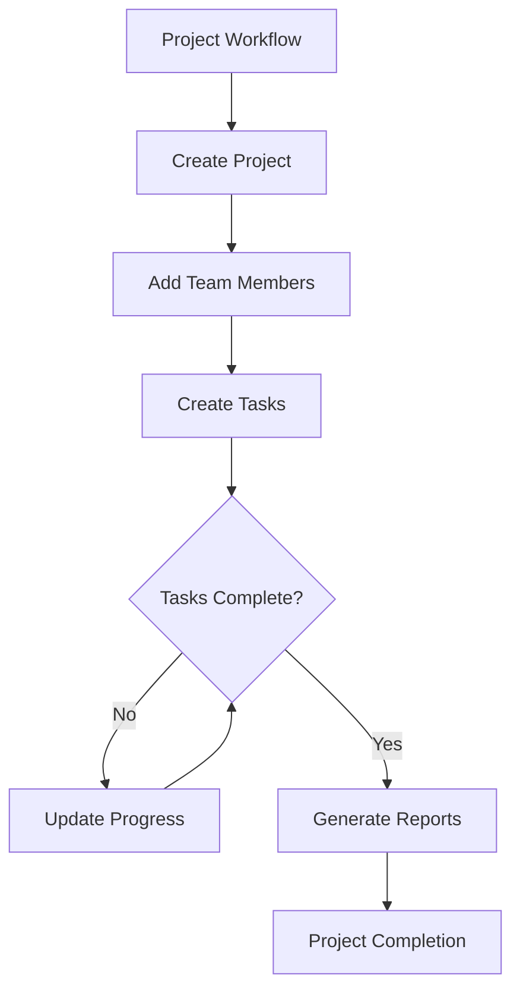
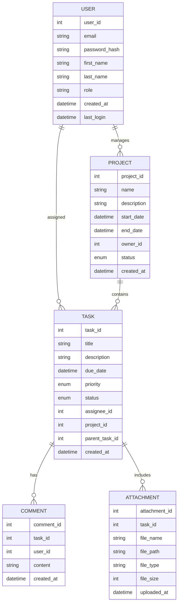
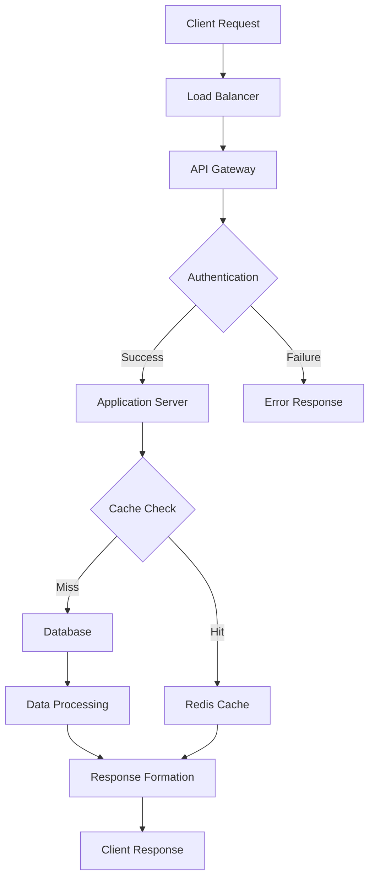

# Product Requirements Document (PRD)

# 1. INTRODUCTION

## 1.1 Purpose

This Software Requirements Specification (SRS) document provides a comprehensive description of the Task Management System. It details the functional and non-functional requirements for the development team, project stakeholders, and quality assurance team. The document serves as the primary reference for technical and non-technical audiences to understand the system's intended behavior, constraints, and performance expectations.

Go to next line.

## 1.2 Scope

The Task Management System is a web-based application designed to streamline task organization and team collaboration. The system encompasses:

- Task Creation and Management

  - Create, edit, and delete tasks
  - Assign due dates, priorities, and team members
  - Track task status and progress
  - Attach files and documents

- Project Organization

  - Categorize tasks into projects
  - Set project hierarchies and dependencies
  - Monitor project timelines and milestones

- Team Collaboration

  - Real-time updates and notifications
  - Comment threads on tasks
  - File sharing capabilities
  - Team member availability tracking

- Access Control

  - Role-based permissions (Admin, Manager, Team Member)
  - User authentication and authorization
  - Secure data access

- Reporting and Analytics

  - Task completion metrics
  - Team productivity reports
  - Project progress tracking
  - Custom dashboard views

The system will improve team efficiency, enhance communication, and provide clear visibility into project progress while maintaining data security and user privacy.

# 2. PRODUCT DESCRIPTION

## 2.1 Product Perspective

The Task Management System operates as a standalone web application while integrating with existing enterprise infrastructure:

- Deployment Environment

  - Cloud-based architecture
  - Web browsers as primary client interface
  - Mobile-responsive design for cross-device accessibility

- System Interfaces

  - RESTful API for third-party integrations
  - Email server integration for notifications
  - Cloud storage services for file attachments
  - Single Sign-On (SSO) compatibility

- User Interfaces

  - Modern web interface with responsive design
  - Command-line interface for administrative functions
  - API endpoints for programmatic access

## 2.2 Product Functions

The system provides the following core functionalities:

| Function Category | Key Features |
| --- | --- |
| Task Management | - Task creation and modification - Priority and status tracking - Due date management - Task dependencies - File attachments |
| Project Organization | - Project hierarchy creation - Milestone tracking - Resource allocation - Timeline visualization |
| Team Collaboration | - Real-time updates - Comment threads - @mentions and notifications - Shared workspaces |
| Reporting | - Progress tracking - Performance analytics - Custom report generation - Data export capabilities |
| Administration | - User management - Permission controls - System configuration - Audit logging |

## 2.3 User Characteristics

### 2.3.1 Primary User Personas

1. Project Manager

   - Advanced technical proficiency
   - Needs comprehensive project oversight
   - Focuses on resource allocation and timeline management

2. Team Member

   - Basic to intermediate technical skills
   - Task execution and updates
   - Collaboration with team members

3. Department Head

   - Intermediate technical proficiency
   - Strategic overview of multiple projects
   - Resource planning and performance monitoring

4. System Administrator

   - Advanced technical expertise
   - System configuration and maintenance
   - User access management

## 2.4 Constraints

1. Technical Constraints

   - Must support latest versions of major browsers (Chrome, Firefox, Safari, Edge)
   - Maximum file attachment size: 25MB
   - Response time \< 2 seconds for standard operations
   - 99.9% system availability

2. Regulatory Constraints

   - GDPR compliance for data privacy
   - SOC 2 compliance for security
   - Data retention policies
   - Audit trail requirements

3. Business Constraints

   - Must integrate with existing enterprise systems
   - Support for minimum 1000 concurrent users
   - Maximum 4-hour maintenance windows
   - Multi-language support requirement

## 2.5 Assumptions and Dependencies

### 2.5.1 Assumptions

1. Users have stable internet connectivity
2. Modern web browsers are available to all users
3. Basic technical literacy among all users
4. Email system availability for notifications
5. Sufficient storage capacity for file attachments

### 2.5.2 Dependencies

1. Third-party Services

   - Cloud infrastructure provider
   - Email service provider
   - File storage service
   - Authentication service

2. Technical Dependencies

   - Database management system
   - Web server technology
   - Frontend framework compatibility
   - API gateway services

3. Organizational Dependencies

   - IT support availability
   - User training resources
   - Security policy compliance
   - Change management procedures

# 3. PROCESS FLOWCHART

# 4. FUNCTIONAL REQUIREMENTS

## 4.1 User Authentication and Authorization

### ID: FR-1

### Description

User authentication and authorization system managing access control and security.

### Priority: High

### Requirements

| ID | Requirement | Priority |
| --- | --- | --- |
| FR-1.1 | Support email and password authentication | High |
| FR-1.2 | Implement Single Sign-On (SSO) integration | Medium |
| FR-1.3 | Provide role-based access control (Admin, Manager, Team Member) | High |
| FR-1.4 | Enable two-factor authentication | Medium |
| FR-1.5 | Maintain session management and timeout controls | High |

## 4.2 Task Management

### ID: FR-2

### Description

Core task creation and management functionality.

### Priority: High

### Requirements

| ID | Requirement | Priority |
| --- | --- | --- |
| FR-2.1 | Create, edit, and delete tasks with title, description, and status | High |
| FR-2.2 | Set and modify task due dates and priorities | High |
| FR-2.3 | Assign and reassign tasks to team members | High |
| FR-2.4 | Support file attachments up to 25MB | Medium |
| FR-2.5 | Enable task dependencies and subtasks | Medium |

## 4.3 Project Organization

### ID: FR-3

### Description

Project structure and hierarchy management.

### Priority: High

### Requirements

| ID | Requirement | Priority |
| --- | --- | --- |
| FR-3.1 | Create and manage project hierarchies | High |
| FR-3.2 | Set project milestones and deadlines | High |
| FR-3.3 | Configure project-specific team access | Medium |
| FR-3.4 | Track project progress and completion status | High |
| FR-3.5 | Support project templates and duplication | Low |

## 4.4 Team Collaboration

### ID: FR-4

### Description

Features enabling team communication and collaboration.

### Priority: High

### Requirements

| ID | Requirement | Priority |
| --- | --- | --- |
| FR-4.1 | Real-time task updates and notifications | High |
| FR-4.2 | Comment threads on tasks and projects | High |
| FR-4.3 | @mentions functionality for team members | Medium |
| FR-4.4 | Shared workspace for team resources | Medium |
| FR-4.5 | Team member availability tracking | Low |

## 4.5 Reporting and Analytics

### ID: FR-5

### Description

Data analysis and reporting capabilities.

### Priority: Medium

### Requirements

| ID | Requirement | Priority |
| --- | --- | --- |
| FR-5.1 | Generate task completion and productivity reports | High |
| FR-5.2 | Create custom dashboard views | Medium |
| FR-5.3 | Export reports in multiple formats (PDF, CSV, Excel) | Medium |
| FR-5.4 | Track time spent on tasks | Medium |
| FR-5.5 | Provide project progress visualization | Medium |

## 4.6 System Administration

### ID: FR-6

### Description

Administrative functions for system management.

### Priority: High

### Requirements

| ID | Requirement | Priority |
| --- | --- | --- |
| FR-6.1 | Manage user accounts and permissions | High |
| FR-6.2 | Configure system-wide settings | High |
| FR-6.3 | Monitor system performance and usage | Medium |
| FR-6.4 | Maintain audit logs | High |
| FR-6.5 | Perform backup and restoration | High |

# 5. NON-FUNCTIONAL REQUIREMENTS

## 5.1 Performance

| Requirement ID | Description | Target Metric |
| --- | --- | --- |
| NFR-P1 | Page Load Time | \< 2 seconds for initial load, \< 1 second for subsequent loads |
| NFR-P2 | API Response Time | \< 500ms for 95% of requests |
| NFR-P3 | Concurrent Users | Support 1000+ simultaneous users |
| NFR-P4 | Database Query Time | \< 100ms for 90% of queries |
| NFR-P5 | File Upload/Download | Process 25MB files within 10 seconds |
| NFR-P6 | Real-time Updates | \< 2 second propagation delay |
| NFR-P7 | Memory Usage | \< 512MB per server instance |
| NFR-P8 | CPU Utilization | \< 70% under normal load |

## 5.2 Safety

| Requirement ID | Description | Implementation |
| --- | --- | --- |
| NFR-S1 | Data Backup | Automated daily backups with 30-day retention |
| NFR-S2 | Disaster Recovery | Recovery Time Objective (RTO) \< 4 hours |
| NFR-S3 | Data Loss Prevention | Recovery Point Objective (RPO) \< 1 hour |
| NFR-S4 | Failover System | Automatic failover to secondary systems |
| NFR-S5 | Error Handling | Graceful degradation of services |
| NFR-S6 | Data Validation | Input validation for all user-submitted data |

## 5.3 Security

| Requirement ID | Description | Specification |
| --- | --- | --- |
| NFR-SE1 | Authentication | Multi-factor authentication support |
| NFR-SE2 | Authorization | Role-based access control (RBAC) |
| NFR-SE3 | Data Encryption | AES-256 for data at rest, TLS 1.3 for data in transit |
| NFR-SE4 | Session Management | 30-minute timeout, secure session tokens |
| NFR-SE5 | Password Policy | Minimum 12 characters, complexity requirements |
| NFR-SE6 | Audit Logging | Complete audit trail of all system actions |
| NFR-SE7 | Penetration Testing | Quarterly security assessments |
| NFR-SE8 | API Security | OAuth 2.0 and API key authentication |

## 5.4 Quality

### 5.4.1 Availability

- System uptime: 99.9% excluding planned maintenance
- Planned maintenance windows: Maximum 4 hours monthly
- Automatic monitoring and alerting system
- Geographic redundancy for critical components

### 5.4.2 Maintainability

- Modular architecture for easy updates
- Comprehensive API documentation
- Automated deployment pipeline
- Code coverage minimum 80%
- Standardized logging format

### 5.4.3 Usability

- Intuitive interface requiring minimal training
- Mobile-responsive design
- Maximum 3 clicks to reach any feature
- Support for multiple languages
- Consistent UI/UX patterns
- Accessibility compliance with WCAG 2.1 Level AA

### 5.4.4 Scalability

- Horizontal scaling capability
- Auto-scaling based on load
- Database partitioning support
- Microservices architecture
- Load balancing across multiple servers

### 5.4.5 Reliability

- Mean Time Between Failures (MTBF): \> 720 hours
- Mean Time To Repair (MTTR): \< 2 hours
- Error rate: \< 0.1% of all transactions
- Automated system health checks
- Fault tolerance for critical components

## 5.5 Compliance

| Requirement ID | Description | Standard/Regulation |
| --- | --- | --- |
| NFR-C1 | Data Privacy | GDPR, CCPA compliance |
| NFR-C2 | Security Standards | SOC 2 Type II certification |
| NFR-C3 | Accessibility | WCAG 2.1 Level AA |
| NFR-C4 | Data Storage | Regional data residency requirements |
| NFR-C5 | Audit Requirements | ISO 27001 compliance |
| NFR-C6 | Industry Standards | REST API standards |
| NFR-C7 | Documentation | Technical documentation standards |
| NFR-C8 | Browser Support | Support for latest versions of major browsers |

# 6. DATA REQUIREMENTS

## 6.1 Data Models

## 6.2 Data Storage

### 6.2.1 Database Requirements

- Primary Database: PostgreSQL for structured data
- Document Store: MongoDB for unstructured data and attachments
- Cache Layer: Redis for session management and real-time updates

### 6.2.2 Data Retention

- Active Data: Indefinite retention with archival after 2 years
- Deleted Items: Soft deletion with 30-day recovery window
- Audit Logs: 7-year retention period
- System Logs: 90-day retention
- File Attachments: Archived after 1 year of inactivity

### 6.2.3 Backup and Recovery

- Full Database Backup: Daily
- Incremental Backups: Every 6 hours
- Point-in-time Recovery: Up to 30 days
- Backup Storage: Geographically distributed locations
- Recovery Time Objective (RTO): 4 hours
- Recovery Point Objective (RPO): 1 hour

### 6.2.4 Data Redundancy

- Database Replication: Master-slave configuration
- Synchronous Replication: For critical transactions
- Asynchronous Replication: For non-critical data
- Geographic Redundancy: Minimum 3 data centers
- Data Mirroring: Real-time mirror across regions

## 6.3 Data Processing

### 6.3.1 Data Flow

### 6.3.2 Data Security

- Encryption at Rest: AES-256
- Encryption in Transit: TLS 1.3
- Data Masking: For sensitive information
- Access Control: Role-based with least privilege
- Data Classification:
  - Public
  - Internal
  - Confidential
  - Restricted

### 6.3.3 Data Validation

- Input Sanitization
- Type Checking
- Range Validation
- Format Validation
- Business Rule Validation

### 6.3.4 Data Transformation

- JSON Serialization/Deserialization
- Date/Time Normalization
- Character Encoding: UTF-8
- File Format Conversion
- Data Compression for Storage

### 6.3.5 Data Integration

- RESTful API Endpoints
- Batch Processing
- Real-time Event Processing
- ETL Processes
- Data Synchronization

# 7. EXTERNAL INTERFACES

## 7.1 User Interfaces

### 7.1.1 Web Application Interface

- Responsive design supporting viewport sizes from 320px to 4K resolution
- Material Design 3 component library implementation
- Minimum touch target size of 44x44 pixels for mobile interfaces
- Maximum content width of 1440px with responsive breakpoints at:
  - Mobile: 320px - 767px
  - Tablet: 768px - 1023px
  - Desktop: 1024px - 1440px
  - Large Desktop: \> 1440px

### 7.1.2 Key Interface Components

| Component | Requirements |
| --- | --- |
| Navigation | - Persistent top navigation bar - Collapsible side menu - Breadcrumb trail |
| Dashboard | - Customizable widget layout - Drag-and-drop interface - Real-time updates |
| Task Views | - List view - Kanban board - Calendar view - Gantt chart |
| Forms | - Inline validation - Auto-save functionality - Progressive disclosure |
| Notifications | - Toast messages - Badge indicators - Modal alerts |

### 7.1.3 Accessibility Requirements

- WCAG 2.1 Level AA compliance
- Support for screen readers
- Keyboard navigation
- Color contrast ratio minimum 4.5:1
- Focus indicators for interactive elements

## 7.2 Hardware Interfaces

### 7.2.1 Client Devices

- Minimum CPU: 1.6GHz dual-core processor
- Minimum RAM: 4GB
- Storage: 500MB free space for cache
- Display: Minimum resolution 320x480
- Input devices: Keyboard, mouse, touch screen support

### 7.2.2 Server Infrastructure

- Load Balancers: AWS Application Load Balancer
- Compute: AWS EC2 instances
- Storage: AWS EBS volumes
- Network Interface: 1Gbps minimum bandwidth
- Backup Hardware: AWS S3 for file storage

## 7.3 Software Interfaces

### 7.3.1 Client-Side Requirements

| Browser | Minimum Version |
| --- | --- |
| Chrome | 90+ |
| Firefox | 88+ |
| Safari | 14+ |
| Edge | 90+ |
| Mobile Safari | iOS 14+ |
| Chrome Mobile | Android 8+ |

### 7.3.2 Server-Side Integrations

| System | Interface Type | Purpose |
| --- | --- | --- |
| PostgreSQL | Database | Primary data storage |
| Redis | Cache | Session and real-time data |
| MongoDB | Database | Document storage |
| AWS S3 | API | File storage |
| SendGrid | API | Email notifications |
| Elasticsearch | API | Search functionality |

### 7.3.3 Third-Party Services

| Service | Integration Method | Data Format |
| --- | --- | --- |
| SSO Providers | OAuth 2.0 | JWT |
| Payment Gateway | REST API | JSON |
| Analytics Service | SDK | JSON |
| Cloud Storage | REST API | Binary/JSON |
| CI/CD Pipeline | Webhook | JSON |

## 7.4 Communication Interfaces

### 7.4.1 Network Protocols

- HTTPS (TLS 1.3) for all client-server communication
- WebSocket for real-time updates
- SMTP for email notifications
- REST for API communications
- gRPC for internal service communication

### 7.4.2 API Specifications

| Endpoint Type | Protocol | Format | Authentication |
| --- | --- | --- | --- |
| REST API | HTTPS | JSON | JWT/OAuth 2.0 |
| WebSocket | WSS | JSON | Token-based |
| Internal API | gRPC | Protocol Buffers | mTLS |
| Webhook | HTTPS | JSON | API Key |

### 7.4.3 Data Exchange Formats

- JSON for API responses
- Protocol Buffers for internal communication
- JWT for authentication tokens
- Base64 for file transfers
- UTF-8 encoding for all text data

# 8. APPENDICES

## 8.1 GLOSSARY

| Term | Definition |
| --- | --- |
| Dashboard | A customizable interface displaying key metrics, tasks, and project information |
| Kanban Board | Visual project management tool organizing tasks in columns representing workflow stages |
| Milestone | A significant point or event in a project timeline |
| Sprint | A fixed time period during which specific work must be completed |
| Subtask | A smaller task that is part of a larger parent task |
| Webhook | Automated message sent from an application when an event occurs |
| Workspace | A shared digital environment where team members can collaborate on projects |

## 8.2 ACRONYMS

| Acronym | Definition |
| --- | --- |
| API | Application Programming Interface |
| CCPA | California Consumer Privacy Act |
| GDPR | General Data Protection Regulation |
| JWT | JSON Web Token |
| mTLS | Mutual Transport Layer Security |
| RBAC | Role-Based Access Control |
| REST | Representational State Transfer |
| RTO | Recovery Time Objective |
| RPO | Recovery Point Objective |
| SOC | Service Organization Control |
| SSO | Single Sign-On |
| TLS | Transport Layer Security |
| WCAG | Web Content Accessibility Guidelines |
| WSS | WebSocket Secure |

## 8.3 ADDITIONAL REFERENCES

| Reference | Description | URL |
| --- | --- | --- |
| Material Design 3 | UI component library specifications | https://m3.material.io/ |
| OAuth 2.0 | Authorization framework specification | https://oauth.net/2/ |
| PostgreSQL Documentation | Database reference | https://www.postgresql.org/docs/ |
| Redis Documentation | Cache system documentation | https://redis.io/documentation |
| AWS Best Practices | Cloud infrastructure guidelines | https://aws.amazon.com/architecture/well-architected/ |
| WCAG 2.1 Guidelines | Web accessibility standards | https://www.w3.org/WAI/WCAG21/quickref/ |

## 8.4 TECHNOLOGY STACK

| Category | Technology |
| --- | --- |
| Frontend Framework | React.js |
| State Management | Redux |
| UI Components | Material-UI |
| Backend Framework | Node.js with Express |
| Primary Database | PostgreSQL |
| Cache Layer | Redis |
| Document Store | MongoDB |
| Search Engine | Elasticsearch |
| Message Queue | RabbitMQ |
| File Storage | AWS S3 |
| CI/CD | Jenkins |
| Monitoring | Prometheus & Grafana |
| Load Balancer | AWS ALB |
| Container Platform | Docker |
| Container Orchestration | Kubernetes |