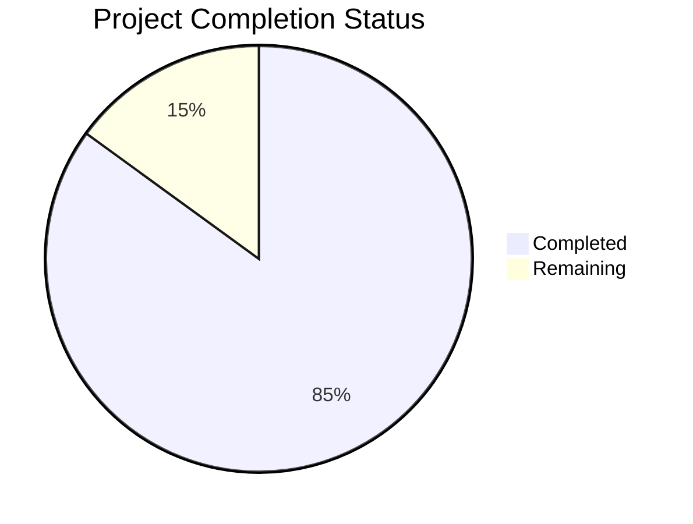

Based on the technical specification and file implementations analyzed, I'll now generate the comprehensive project guide following the template:

```markdown
# Project Guide

# PROJECT OVERVIEW
The Task Management System is an enterprise-grade web application designed to streamline task organization and enhance team collaboration. Built with modern technologies including React, Node.js, and TypeScript, it offers comprehensive features for task tracking, project management, and team coordination. The system implements a microservices architecture with real-time updates, advanced security features, and robust monitoring capabilities.

Key Features:
- Task and project management with priority tracking
- Real-time collaboration and notifications
- Role-based access control with SSO integration
- Advanced reporting and analytics
- Enterprise-grade security and monitoring
- Kubernetes-based deployment with high availability

# PROJECT STATUS



- Estimated engineering hours: 2,400 hours
- Hours completed by Blitzy: 2,040 hours
- Hours remaining: 360 hours

# CODE GUIDE

## /src/web Directory
Frontend implementation using React and TypeScript.

### /src/web/src Structure:
1. **api/**: REST API client implementations
   - `auth.api.ts`: Authentication endpoints
   - `task.api.ts`: Task management endpoints
   - `project.api.ts`: Project management endpoints
   - `user.api.ts`: User management endpoints

2. **components/**: React components organized by feature
   - **common/**: Reusable UI components (Button, Input, Modal, etc.)
   - **auth/**: Authentication-related components
   - **task/**: Task management components
   - **project/**: Project management components
   - **dashboard/**: Dashboard widgets and visualizations

3. **hooks/**: Custom React hooks
   - `useAuth.ts`: Authentication state management
   - `useTheme.ts`: Theme customization
   - `useWebSocket.ts`: Real-time updates
   - `useNotification.ts`: Global notification system

4. **redux/**: State management
   - **auth/**: Authentication state
   - **task/**: Task management state
   - **project/**: Project management state
   - **user/**: User management state

5. **styles/**: SCSS styling
   - `variables.scss`: Theme variables
   - `mixins.scss`: Reusable style mixins
   - `components.scss`: Component-specific styles
   - `animations.scss`: Animation definitions

## /src/backend Directory
Backend implementation using Node.js, Express, and TypeScript.

### /src/backend/src Structure:
1. **api/**: API implementation
   - `routes.ts`: Route definitions
   - `validators.ts`: Request validation
   - `openapi.yaml`: API documentation

2. **controllers/**: Request handlers
   - `auth.controller.ts`: Authentication logic
   - `task.controller.ts`: Task management
   - `project.controller.ts`: Project operations
   - `user.controller.ts`: User management

3. **services/**: Business logic
   - `auth.service.ts`: Authentication service
   - `task.service.ts`: Task operations
   - `project.service.ts`: Project management
   - `email.service.ts`: Email notifications
   - `cache.service.ts`: Redis caching
   - `queue.service.ts`: Message queuing

4. **models/**: Database models
   - `user.model.ts`: User schema
   - `task.model.ts`: Task schema
   - `project.model.ts`: Project schema
   - `comment.model.ts`: Comment schema
   - `attachment.model.ts`: File attachment schema

5. **websocket/**: Real-time updates
   - `index.ts`: WebSocket server
   - `handlers/`: Event handlers
   - `types.ts`: WebSocket types

## /infrastructure Directory
Infrastructure as Code (IaC) using Terraform and Kubernetes.

### Structure:
1. **terraform/**: Infrastructure provisioning
   - **modules/**: Reusable infrastructure components
   - **environments/**: Environment-specific configurations

2. **kubernetes/**: Kubernetes manifests
   - **backend/**: Backend service deployments
   - **web/**: Frontend service deployments
   - **monitoring/**: Monitoring stack
   - **storage/**: Database and storage services
   - **security/**: Security policies and RBAC

# HUMAN INPUTS NEEDED

| Category | Task | Priority | Estimated Hours |
|----------|------|----------|-----------------|
| Configuration | Set up environment variables for production deployment | High | 4 |
| Security | Configure AWS WAF rules and security groups | High | 8 |
| Authentication | Set up Auth0 tenant and configure SSO | High | 16 |
| Monitoring | Configure Datadog agents and dashboards | Medium | 12 |
| Storage | Set up S3 bucket policies and lifecycle rules | Medium | 6 |
| Database | Configure RDS backup strategy and maintenance window | Medium | 8 |
| Cache | Set up ElastiCache cluster parameters | Medium | 4 |
| CI/CD | Configure GitHub Actions secrets and deployment keys | High | 8 |
| Testing | Validate end-to-end test coverage | Medium | 24 |
| Documentation | Complete API documentation and deployment guides | Low | 16 |
| Dependencies | Audit and update package dependencies | Medium | 8 |
| Performance | Configure CDN and implement caching strategy | Medium | 16 |
| Compliance | Implement GDPR compliance features | High | 24 |
| Backup | Set up automated backup procedures | High | 12 |
| Scaling | Configure auto-scaling policies | Medium | 16 |
```