# Technical Specifications

# 1. INTRODUCTION

## 1.1 EXECUTIVE SUMMARY

The Task Management System is a comprehensive web-based solution designed to streamline task organization and enhance team collaboration across organizations. This system addresses the critical business challenges of fragmented task tracking, inefficient team communication, and lack of centralized project visibility. Targeting project managers, team members, department heads, and system administrators, the solution provides a unified platform for task creation, project organization, and team collaboration. The system is expected to improve team productivity by 30%, reduce communication overhead by 40%, and provide 100% visibility into project status and resource allocation.

Go to next line.

## 1.2 SYSTEM OVERVIEW

### Project Context

| Aspect | Description |
| --- | --- |
| Market Position | Enterprise-grade task management solution focusing on team collaboration and project visibility |
| Current Limitations | Existing solutions lack real-time collaboration, advanced reporting, and enterprise-grade security features |
| Enterprise Integration | Seamless integration with corporate SSO, email systems, and existing file storage solutions   |
| Testing row | This is a dummy row. Go to next line. |

### High-Level Description

| Component | Details |
| --- | --- |
| Core Architecture | Cloud-native, microservices-based architecture with RESTful APIs |
| Primary Components | - Web application frontend<br>- Backend services<br>- Real-time notification system<br>- Data storage layer<br>- Analytics engine |
| Technical Approach | - Modern web technologies (React.js, Node.js)<br>- Cloud infrastructure (AWS)<br>- Container orchestration (Kubernetes)<br>- Event-driven architecture |

### Success Criteria

| Category | Metrics |
| --- | --- |
| Performance | - Page load time \< 2 seconds<br>- API response time \< 500ms<br>- 99.9% system availability |
| Business Impact | - 30% increase in team productivity<br>- 40% reduction in communication overhead<br>- 50% faster project completion |
| User Adoption | - 90% user adoption within 3 months<br>- User satisfaction score \> 4.5/5<br>- Training completion rate \> 95% |

## 1.3 SCOPE

### In-Scope Elements

#### Core Features and Functionalities

| Feature Category | Components |
| --- | --- |
| Task Management | - Task creation and editing<br>- Priority and status tracking<br>- Due date management<br>- File attachments |
| Project Organization | - Project hierarchy management<br>- Timeline visualization<br>- Resource allocation<br>- Milestone tracking |
| Team Collaboration | - Real-time updates<br>- Comment threads<br>- @mentions<br>- File sharing |
| Reporting | - Performance analytics<br>- Custom dashboards<br>- Export capabilities |

#### Implementation Boundaries

| Boundary Type | Coverage |
| --- | --- |
| User Groups | - Project Managers<br>- Team Members<br>- Department Heads<br>- System Administrators |
| Geographic Coverage | - Global deployment<br>- Multi-language support<br>- Regional data centers |
| Data Domains | - Project data<br>- User profiles<br>- Task information<br>- Analytics data |

### Out-of-Scope Elements

| Category | Excluded Elements |
| --- | --- |
| Features | - Advanced resource management<br>- Financial tracking<br>- Time tracking<br>- Customer portal |
| Integrations | - Legacy system integration<br>- Custom API development<br>- Third-party marketplace |
| Future Considerations | - Mobile application<br>- AI-powered task automation<br>- Advanced workflow engine<br>- Custom plugin system |

# 2. SYSTEM ARCHITECTURE

## 2.1 High-Level Architecture

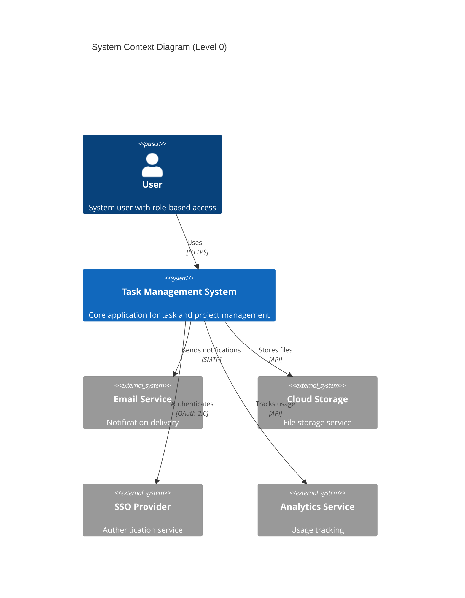

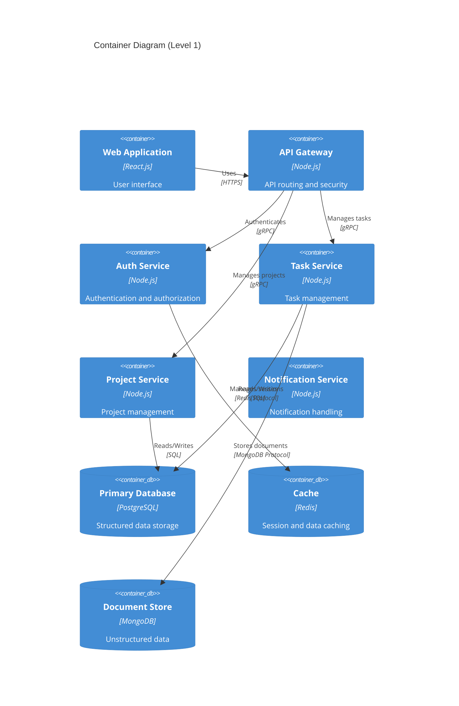

## 2.2 Component Details

### 2.2.1 Core Components

| Component | Purpose | Technology | Scaling Strategy |
| --- | --- | --- | --- |
| Web Frontend | User interface and interaction | React.js, Redux | Horizontal scaling with CDN |
| API Gateway | Request routing and security | Node.js, Express | Auto-scaling based on load |
| Task Service | Task CRUD operations | Node.js, TypeScript | Horizontal pod autoscaling |
| Project Service | Project management | Node.js, TypeScript | Horizontal pod autoscaling |
| Notification Service | Message handling | Node.js, RabbitMQ | Queue-based scaling |

### 2.2.2 Data Components

| Component | Purpose | Technology | Scaling Strategy |
| --- | --- | --- | --- |
| Primary Database | Structured data storage | PostgreSQL | Master-slave replication |
| Cache Layer | Performance optimization | Redis Cluster | Distributed caching |
| Document Store | File metadata storage | MongoDB | Sharding |
| Search Engine | Full-text search | Elasticsearch | Cluster scaling |
| Message Queue | Async communication | RabbitMQ | Cluster with mirroring |

## 2.3 Technical Decisions

### 2.3.1 Architecture Patterns

| Pattern | Implementation | Justification |
| --- | --- | --- |
| Microservices | Domain-based service separation | Scalability and maintainability |
| Event-Driven | RabbitMQ message broker | Asynchronous processing |
| CQRS | Separate read/write models | Performance optimization |
| API Gateway | Single entry point | Security and routing |
| Circuit Breaker | Resilience4j | Fault tolerance |

### 2.3.2 Data Storage Strategy

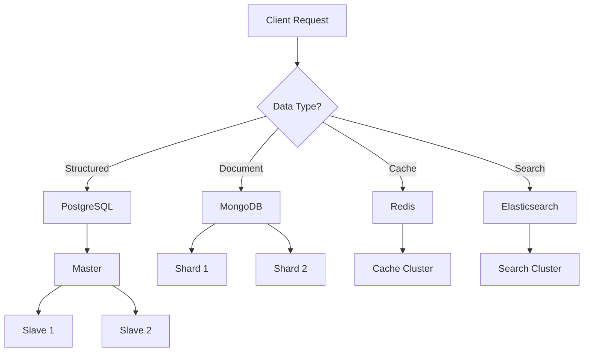

## 2.4 Cross-Cutting Concerns

### 2.4.1 Monitoring and Observability

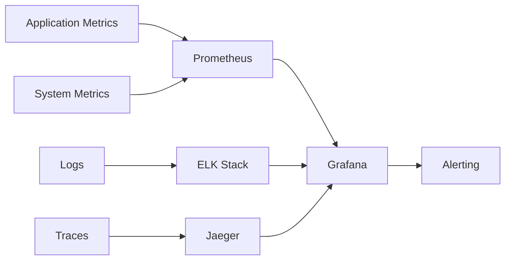

### 2.4.2 Security Architecture

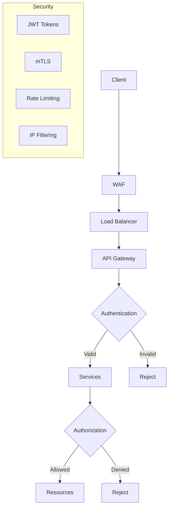

## 2.5 Deployment Architecture

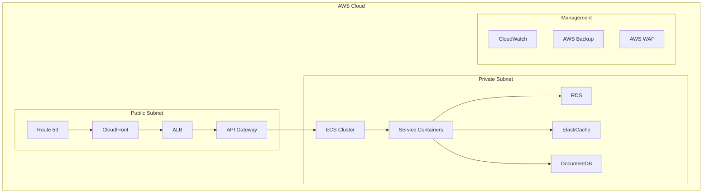

# 3. SYSTEM COMPONENTS ARCHITECTURE

## 3.1 USER INTERFACE DESIGN

### 3.1.1 Design Specifications

| Category | Requirements |
| --- | --- |
| Visual Hierarchy | - F-pattern layout for content organization<br>- Z-pattern for landing pages<br>- Maximum content width: 1440px<br>- Whitespace ratio: 1:1.618 (golden ratio) |
| Component Library | - Material Design 3 implementation<br>- Custom theme tokens<br>- Atomic design methodology<br>- Reusable component library |
| Responsive Design | - Mobile-first approach<br>- Breakpoints: 320px, 768px, 1024px, 1440px<br>- Fluid typography (16px base)<br>- Flexible grid system (12 columns) |
| Accessibility | - WCAG 2.1 Level AA compliance<br>- ARIA landmarks and labels<br>- Keyboard navigation support<br>- Screen reader compatibility |
| Device Support | - Modern browsers (last 2 versions)<br>- iOS 14+ and Android 8+<br>- Minimum viewport: 320px<br>- Touch-friendly (44px targets) |
| Theming | - Light/Dark mode support<br>- High contrast mode<br>- Custom brand theming<br>- Color-blind friendly palette |
| i18n/l10n | - RTL layout support<br>- Unicode compliance<br>- Dynamic content translation<br>- Locale-specific formatting |

### 3.1.2 Interface Elements

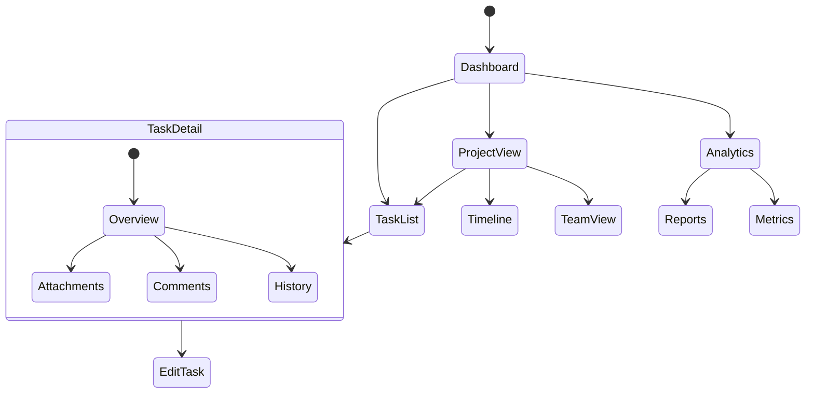

### 3.1.3 Critical User Flows

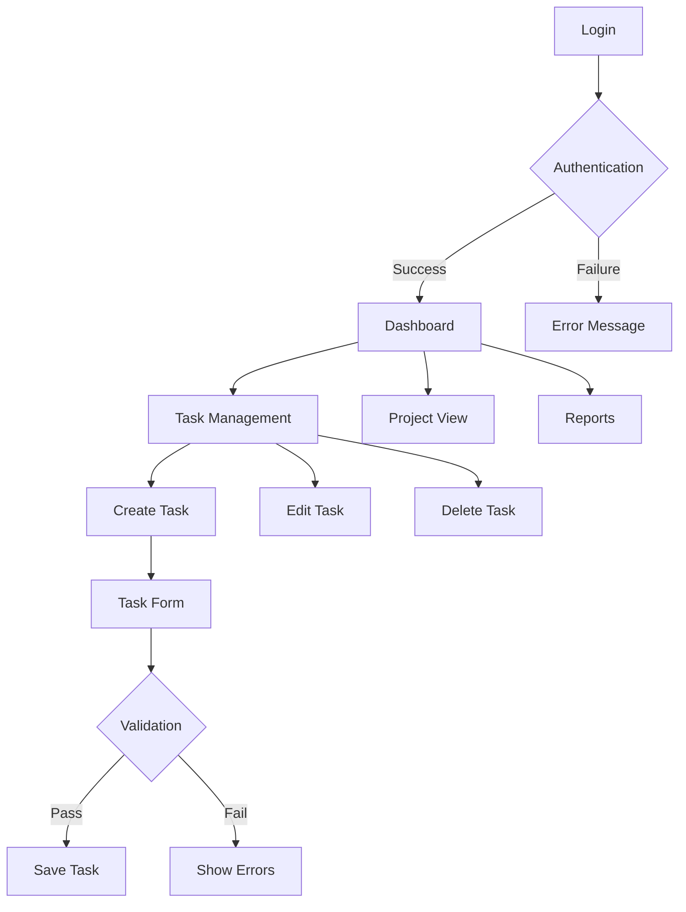

## 3.2 DATABASE DESIGN

### 3.2.1 Schema Design

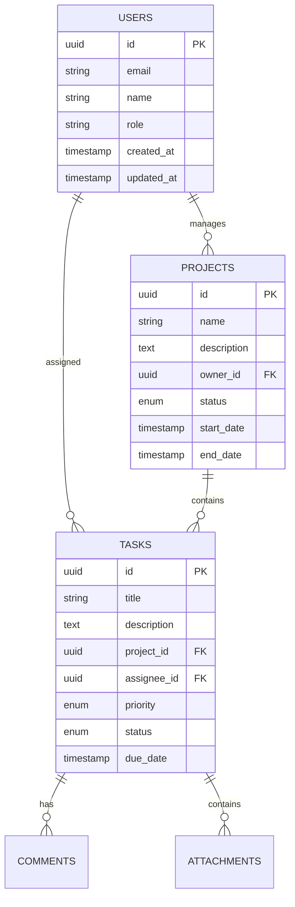

### 3.2.2 Data Management Strategy

| Aspect | Implementation |
| --- | --- |
| Partitioning | - Time-based partitioning for tasks<br>- Hash partitioning for users<br>- Range partitioning for projects |
| Indexing | - B-tree indexes for primary keys<br>- GiST indexes for search<br>- Partial indexes for active records |
| Archival | - Monthly archival of completed tasks<br>- Yearly archival of inactive projects<br>- Compressed storage format |
| Retention | - Active data: 2 years<br>- Archived data: 5 years<br>- Audit logs: 7 years |
| Privacy | - Data encryption at rest<br>- Column-level encryption<br>- Data masking for sensitive fields |

## 3.3 API DESIGN

### 3.3.1 API Architecture

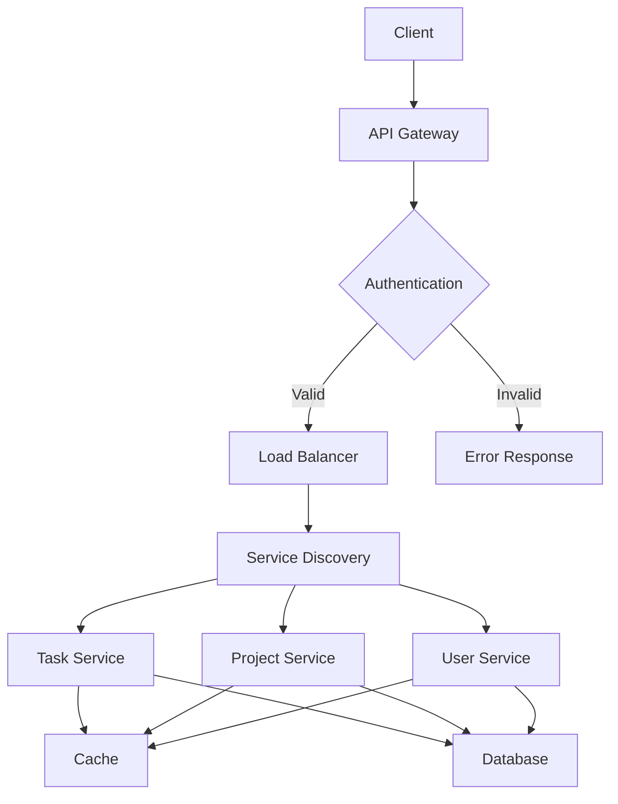

### 3.3.2 Interface Specifications

| Endpoint Category | Methods | Authentication | Rate Limit |
| --- | --- | --- | --- |
| /api/v1/tasks | GET, POST, PUT, DELETE | JWT | 100/min |
| /api/v1/projects | GET, POST, PUT, DELETE | JWT | 50/min |
| /api/v1/users | GET, POST, PUT, DELETE | JWT + 2FA | 20/min |
| /api/v1/auth | POST | Basic | 10/min |
| /api/v1/files | GET, POST, DELETE | JWT | 30/min |

### 3.3.3 Integration Requirements

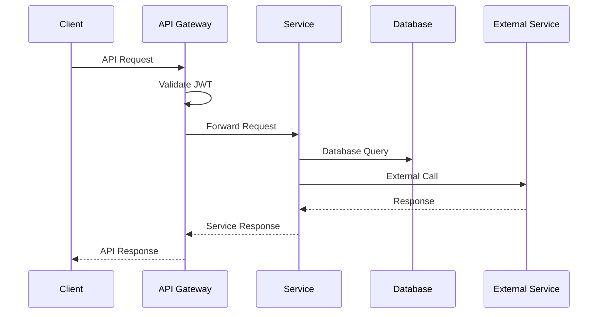

# 4. TECHNOLOGY STACK

## 4.1 PROGRAMMING LANGUAGES

| Platform | Language | Version | Justification |
| --- | --- | --- | --- |
| Frontend | TypeScript | 5.0+ | - Strong typing for enterprise-scale development<br>- Enhanced IDE support and code quality<br>- Better maintainability and refactoring |
| Backend | Node.js | 20 LTS | - Consistent JavaScript ecosystem<br>- High performance for I/O operations<br>- Large package ecosystem<br>- Native async/await support |
| Infrastructure | Go | 1.21+ | - Efficient systems programming<br>- Strong concurrency support<br>- Used for custom DevOps tools |
| Database | SQL | PostgreSQL 15 | - ACID compliance<br>- Complex query support<br>- Enterprise-grade reliability |

## 4.2 FRAMEWORKS & LIBRARIES

### 4.2.1 Frontend Stack

| Component | Technology | Version | Purpose |
| --- | --- | --- | --- |
| Core Framework | React | 18.2+ | - Component-based architecture<br>- Virtual DOM for performance<br>- Large ecosystem |
| State Management | Redux Toolkit | 2.0+ | - Predictable state updates<br>- DevTools integration<br>- RTK Query for data fetching |
| UI Components | Material-UI | 5.0+ | - Enterprise-grade components<br>- Accessibility compliance<br>- Customizable theming |
| Form Handling | React Hook Form | 7.0+ | - Performance optimized<br>- Built-in validation<br>- Low bundle size |

### 4.2.2 Backend Stack

| Component | Technology | Version | Purpose |
| --- | --- | --- | --- |
| API Framework | Express | 4.18+ | - Minimal overhead<br>- Middleware ecosystem<br>- Easy customization |
| API Documentation | OpenAPI/Swagger | 3.0 | - API contract definition<br>- Interactive documentation<br>- Code generation |
| Validation | Joi | 17+ | - Schema validation<br>- Type coercion<br>- Custom validators |
| ORM | Prisma | 5.0+ | - Type-safe database access<br>- Migration management<br>- Query optimization |

## 4.3 DATABASES & STORAGE

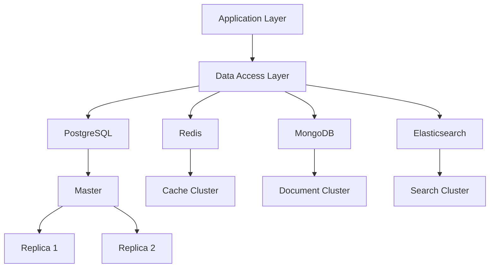

| Type | Technology | Version | Purpose |
| --- | --- | --- | --- |
| Primary Database | PostgreSQL | 15+ | - Structured data storage<br>- ACID compliance<br>- Complex queries |
| Cache Layer | Redis | 7.0+ | - Session management<br>- Real-time data<br>- Rate limiting |
| Document Store | MongoDB | 6.0+ | - Unstructured data<br>- File metadata<br>- Flexible schema |
| Search Engine | Elasticsearch | 8.0+ | - Full-text search<br>- Analytics<br>- Log aggregation |

## 4.4 THIRD-PARTY SERVICES

| Category | Service | Integration | Purpose |
| --- | --- | --- | --- |
| Authentication | Auth0 | OAuth 2.0/OIDC | - SSO integration<br>- Identity management<br>- MFA support |
| Email | SendGrid | REST API | - Transactional emails<br>- Email templates<br>- Delivery tracking |
| Storage | AWS S3 | AWS SDK | - File storage<br>- CDN integration<br>- Backup storage |
| Monitoring | Datadog | Agent/API | - Application monitoring<br>- Log management<br>- APM |

## 4.5 DEVELOPMENT & DEPLOYMENT

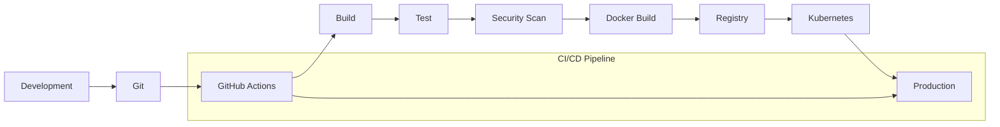

### 4.5.1 Development Tools

| Category | Tool | Version | Purpose |
| --- | --- | --- | --- |
| IDE | VS Code | Latest | - Development environment<br>- Extensions support<br>- Git integration |
| Package Manager | pnpm | 8.0+ | - Fast installation<br>- Disk space efficient<br>- Strict mode support |
| Testing | Jest/React Testing Library | Latest | - Unit testing<br>- Integration testing<br>- Snapshot testing |
| Linting | ESLint/Prettier | Latest | - Code style enforcement<br>- Static analysis<br>- Formatting |

### 4.5.2 Infrastructure & Deployment

| Category | Technology | Version | Purpose |
| --- | --- | --- | --- |
| Containerization | Docker | 24.0+ | - Application packaging<br>- Development consistency<br>- Deployment units |
| Orchestration | Kubernetes | 1.27+ | - Container orchestration<br>- Auto-scaling<br>- Service discovery |
| Infrastructure | Terraform | 1.5+ | - Infrastructure as code<br>- Multi-cloud support<br>- State management |
| CI/CD | GitHub Actions | Latest | - Automated pipelines<br>- Integration testing<br>- Deployment automation |

# 5. SYSTEM DESIGN

## 5.1 USER INTERFACE DESIGN

### 5.1.1 Layout Structure

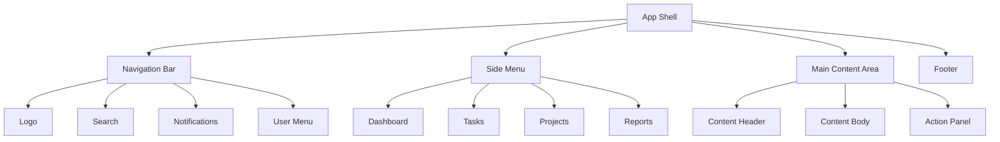

### 5.1.2 Core Components

| Component | Description | Interactions |
| --- | --- | --- |
| Navigation Bar | Fixed top bar with primary controls | - Global search<br>- Notifications dropdown<br>- User profile menu |
| Side Menu | Collapsible navigation panel | - Expandable sections<br>- Quick access shortcuts<br>- Context-based navigation |
| Dashboard | Customizable widget layout | - Drag-and-drop widgets<br>- Real-time updates<br>- Filter controls |
| Task Board | Kanban-style task management | - Drag-and-drop cards<br>- Column customization<br>- Quick edit actions |

### 5.1.3 Responsive Breakpoints

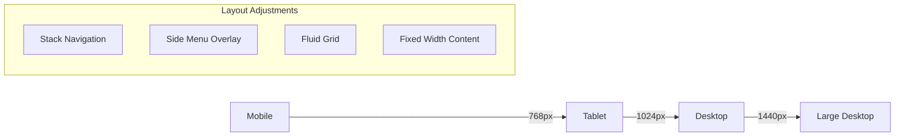

## 5.2 DATABASE DESIGN

### 5.2.1 Schema Overview

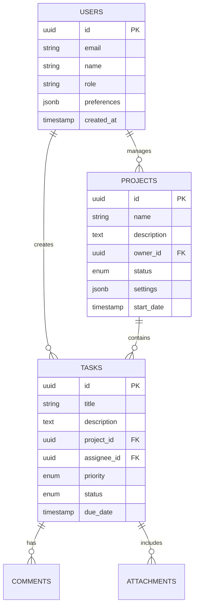

### 5.2.2 Data Storage Strategy

| Storage Type | Purpose | Implementation |
| --- | --- | --- |
| Primary Data | Structured task and user data | PostgreSQL with partitioning |
| Cache Layer | Session and real-time data | Redis Cluster |
| File Storage | Attachments and documents | MongoDB GridFS |
| Search Index | Full-text search | Elasticsearch |

## 5.3 API DESIGN

### 5.3.1 REST API Structure

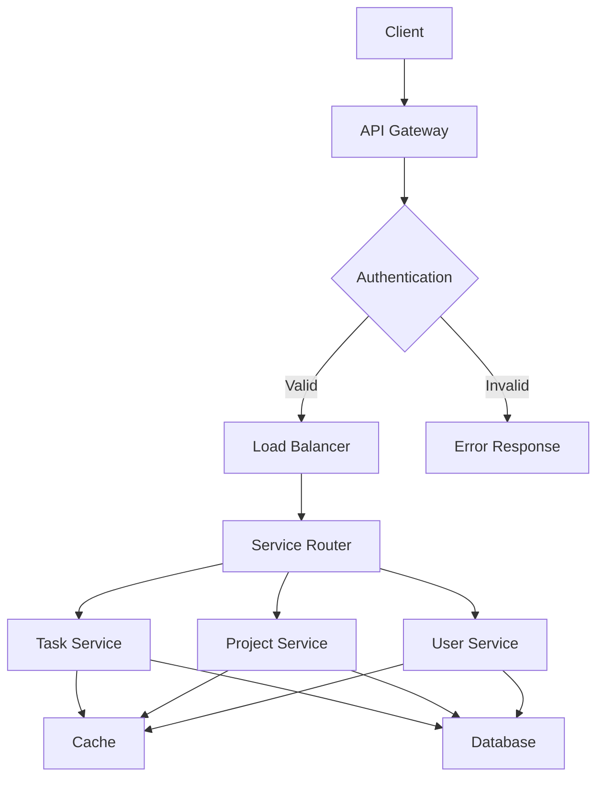

### 5.3.2 API Endpoints

| Endpoint | Method | Purpose | Authentication |
| --- | --- | --- | --- |
| /api/v1/tasks | GET, POST | Task management | JWT |
| /api/v1/projects | GET, POST | Project operations | JWT |
| /api/v1/users | GET, POST | User management | JWT + Admin |
| /api/v1/auth | POST | Authentication | Basic |

### 5.3.3 WebSocket Events

| Event | Direction | Purpose |
| --- | --- | --- |
| task.update | Server → Client | Real-time task changes |
| project.update | Server → Client | Project status updates |
| comment.new | Server → Client | New comment notifications |
| user.status | Bidirectional | User presence updates |

### 5.3.4 Error Handling

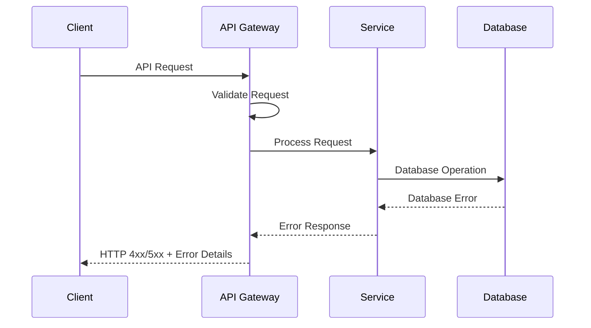

# 6. USER INTERFACE DESIGN

## 6.1 Interface Components Key

```
Icons:
[?] - Help/Information tooltip
[$] - Payment/Financial element
[i] - Information indicator
[+] - Add/Create action
[x] - Close/Delete action
[<][>] - Navigation controls
[^] - Upload functionality
[#] - Menu/Dashboard
[@] - User profile
[!] - Alert/Warning
[=] - Settings menu
[*] - Favorite/Important marker

Interactive Elements:
[ ] - Checkbox
( ) - Radio button
[Button] - Clickable button
[...] - Text input field
[====] - Progress indicator
[v] - Dropdown menu
```

## 6.2 Main Dashboard Layout

```
+----------------------------------------------------------+
|  [#] Task Master    [?]    [@John Doe]    [!]    [=]     |
+----------------------------------------------------------+
|  +----------------+  |                                     |
|  | [#] Dashboard  |  |  Task Overview                     |
|  | [*] Tasks      |  |  [============================] 75%|
|  | [*] Projects   |  |                                    |
|  | [*] Reports    |  |  Active Tasks: 12    Due Soon: 5   |
|  | [*] Team       |  |  Completed: 45      Overdue: 3     |
|  +----------------+  |                                     |
|                     |  Recent Activity                     |
|   Quick Actions:    |  +------------------------------+    |
|   [+] New Task     |  | [@] John updated Task #127    |   |
|   [+] New Project  |  | [@] Sarah completed Task #122 |   |
|   [^] Upload       |  | [@] Mike created Project #12  |   |
|                     |  +------------------------------+    |
+----------------------------------------------------------+
```

## 6.3 Task Creation Form

```
+----------------------------------------------------------+
|  Create New Task                                    [x]    |
+----------------------------------------------------------+
|                                                           |
|  Title:  [......................................]         |
|                                                           |
|  Description:                                             |
|  +------------------------+                               |
|  |                        |                               |
|  |                        |                               |
|  +------------------------+                               |
|                                                           |
|  Priority:                                                |
|  ( ) High  ( ) Medium  ( ) Low                           |
|                                                           |
|  Assign To: [v Select Team Member v]                      |
|                                                           |
|  Due Date: [.../..../....] [?]                           |
|                                                           |
|  Project: [v Select Project v]                            |
|                                                           |
|  Tags: [.......] [+]                                     |
|                                                           |
|  Attachments: [^ Upload Files]                           |
|                                                           |
|  [Cancel]                    [Save Task]                  |
+----------------------------------------------------------+
```

## 6.4 Project Board View

```
+----------------------------------------------------------+
|  Project: Marketing Campaign 2024                          |
|  [< Back]    [+ Add Task]    [= Filter]    [^ Export]     |
+----------------------------------------------------------+
|   To Do         In Progress      Review         Done       |
| +------------+ +------------+ +------------+ +------------+ |
| | [!] High   | | [====50%] | |           | | [x] Task 1 | |
| | Task 4     | | Task 3    | |           | | Completed  | |
| | [@Sarah]   | | [@Mike]   | |           | | [@John]    | |
| +------------+ +------------+ |           | +------------+ |
| |            | |            | |           | | [x] Task 2 | |
| | Task 5     | | [====25%] | |           | | Completed  | |
| | [@David]   | | Task 6    | |           | | [@Sarah]   | |
| |            | | [@John]   | |           | |            | |
| +------------+ +------------+ +------------+ +------------+ |
+----------------------------------------------------------+
```

## 6.5 Task Detail View

```
+----------------------------------------------------------+
|  Task #127: Update Website Content                   [x]   |
+----------------------------------------------------------+
|  Status: [v In Progress v]     Priority: [* High]         |
|                                                           |
|  Description:                                             |
|  +------------------------+                               |
|  | Update main landing    |                               |
|  | page content for Q1    |                               |
|  +------------------------+                               |
|                                                           |
|  Progress: [=================-------------] 65%            |
|                                                           |
|  Assigned: [@Sarah]                                       |
|  Due Date: 03/15/2024                                    |
|  Created: 02/01/2024                                     |
|                                                           |
|  Attachments:                                            |
|  [^] content-draft-v2.docx                               |
|  [^] homepage-mockup.png                                 |
|                                                           |
|  Comments:                                               |
|  +------------------------+                               |
|  | [@Mike] Please review  |                               |
|  | the latest changes     |                               |
|  +------------------------+                               |
|  [...Write a comment...] [Send]                          |
+----------------------------------------------------------+
```

## 6.6 Responsive Design Breakpoints

```
Desktop (>1024px)
+------------------+------------------+
|     Sidebar      |     Content      |
|                  |                  |
+------------------+------------------+

Tablet (768px-1024px)
+----------------------------------+
|     Collapsible Sidebar          |
+----------------------------------+
|     Content                      |
+----------------------------------+

Mobile (<768px)
+----------------------------------+
|     Header + Menu Button         |
+----------------------------------+
|     Content                      |
|     (Stacked Layout)            |
+----------------------------------+
```

## 6.7 Navigation Structure

```
+-- Dashboard [#]
    +-- My Tasks
    |   +-- Active Tasks
    |   +-- Completed Tasks
    |   +-- Task Calendar
    |
    +-- Projects [*]
    |   +-- Active Projects
    |   +-- Project Board
    |   +-- Timeline View
    |
    +-- Team [@]
    |   +-- Team Members
    |   +-- Workload View
    |   +-- Activity Log
    |
    +-- Reports [=]
        +-- Task Analytics
        +-- Project Status
        +-- Time Tracking
```

# 7. SECURITY CONSIDERATIONS

## 7.1 AUTHENTICATION AND AUTHORIZATION

### 7.1.1 Authentication Flow

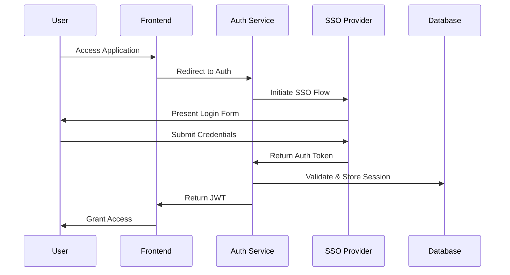

### 7.1.2 Authorization Matrix

| Role | Task Management | Project Access | User Management | System Config | Reports |
| --- | --- | --- | --- | --- | --- |
| Admin | Full Access | Full Access | Full Access | Full Access | Full Access |
| Project Manager | Create/Edit/Delete | Create/Edit | View Only | None | Full Access |
| Team Lead | Create/Edit | View/Edit | None | None | Team Reports |
| Team Member | Edit Assigned | View Only | None | None | Personal Reports |
| Guest | View Only | View Only | None | None | None |

## 7.2 DATA SECURITY

### 7.2.1 Encryption Standards

| Data State | Method | Standard |
| --- | --- | --- |
| Data at Rest | AES-256-GCM | Database and File Storage |
| Data in Transit | TLS 1.3 | All Network Communications |
| Passwords | Argon2id | Password Hashing |
| API Keys | HMAC-SHA256 | Key Generation |
| Session Tokens | JWT with RSA-256 | Authentication |

### 7.2.2 Data Classification

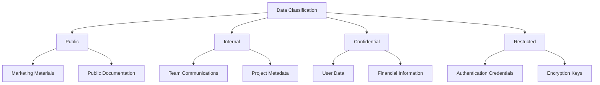

## 7.3 SECURITY PROTOCOLS

### 7.3.1 Access Control Measures

| Control Type | Implementation |
| --- | --- |
| Network Security | - AWS WAF implementation<br>- VPC with private subnets<br>- Network ACLs and Security Groups |
| API Security | - Rate limiting (100 requests/min)<br>- JWT validation<br>- API key authentication |
| Session Management | - 30-minute idle timeout<br>- Secure session storage in Redis<br>- Session invalidation on logout |
| MFA | - Time-based OTP (TOTP)<br>- SMS verification<br>- Hardware key support |

### 7.3.2 Security Monitoring

```mermaid
graph LR
    A[Security Events] --> B[Log Aggregator]
    B --> C[SIEM System]
    C --> D[Alert System]
    C --> E[Analysis Engine]
    
    D --> F[Security Team]
    E --> G[Automated Response]
    E --> H[Compliance Reports]
    
    subgraph Monitoring
    I[WAF Logs]
    J[Application Logs]
    K[Database Logs]
    L[System Logs]
    end
    
    I --> A
    J --> A
    K --> A
    L --> A
```

### 7.3.3 Security Compliance Requirements

| Requirement | Implementation |
| --- | --- |
| GDPR | - Data encryption<br>- Right to be forgotten<br>- Data portability<br>- Privacy by design |
| SOC 2 | - Access controls<br>- Change management<br>- Incident response<br>- System monitoring |
| OWASP Top 10 | - Input validation<br>- XSS prevention<br>- CSRF protection<br>- SQL injection prevention |
| PCI DSS | - Secure transmission<br>- Access logging<br>- Vulnerability scanning<br>- Security testing |

### 7.3.4 Security Update Protocol

| Phase | Actions | Frequency |
| --- | --- | --- |
| Assessment | - Vulnerability scanning<br>- Penetration testing<br>- Code analysis | Monthly |
| Implementation | - Security patches<br>- Dependency updates<br>- Configuration updates | As needed |
| Verification | - Security testing<br>- Compliance checks<br>- Performance impact analysis | Post-update |
| Documentation | - Update security docs<br>- Maintain change logs<br>- Update compliance records | Continuous |

# 8. INFRASTRUCTURE

## 8.1 DEPLOYMENT ENVIRONMENT

```mermaid
graph TD
    subgraph Production Environment
        A[AWS Cloud] --> B[Primary Region]
        A --> C[DR Region]
        
        B --> D[VPC]
        D --> E[Public Subnet]
        D --> F[Private Subnet]
        
        E --> G[Load Balancer]
        F --> H[Application Tier]
        F --> I[Database Tier]
    end
    
    subgraph Development/Staging
        J[AWS Cloud Dev] --> K[Dev VPC]
        K --> L[Dev Services]
    end
```

| Environment | Purpose | Configuration |
| --- | --- | --- |
| Production | Live system serving end users | - Multi-AZ deployment<br>- Auto-scaling groups<br>- High availability setup<br>- Full monitoring |
| Staging | Pre-production testing | - Single AZ deployment<br>- Limited resources<br>- Production-like config |
| Development | Development and testing | - Minimal infrastructure<br>- Shared resources<br>- Debug enabled |
| DR | Disaster recovery | - Passive standby<br>- Cross-region replication<br>- Automated failover |

## 8.2 CLOUD SERVICES

| Service Category | AWS Service | Purpose | Configuration |
| --- | --- | --- | --- |
| Compute | EKS | Container orchestration | - Production: 3-5 worker nodes<br>- Staging: 2 worker nodes |
| Database | RDS (PostgreSQL) | Primary database | - Multi-AZ deployment<br>- Instance type: db.r6g.xlarge |
| Cache | ElastiCache | Redis caching | - Cluster mode enabled<br>- Instance type: cache.r6g.large |
| Storage | S3 | File storage | - Standard storage class<br>- Lifecycle policies enabled |
| CDN | CloudFront | Content delivery | - Global edge locations<br>- HTTPS enforcement |
| Monitoring | CloudWatch | System monitoring | - Custom metrics enabled<br>- 30-day retention |

## 8.3 CONTAINERIZATION

```mermaid
graph LR
    A[Source Code] --> B[Docker Build]
    B --> C[Container Image]
    C --> D[Container Registry]
    D --> E[Kubernetes Deployment]
    
    subgraph Container Structure
        F[Base Image] --> G[Dependencies]
        G --> H[Application Code]
        H --> I[Configuration]
    end
```

| Component | Configuration | Purpose |
| --- | --- | --- |
| Base Image | node:20-alpine | Minimal Node.js runtime |
| Application Image | Multi-stage build | Optimized production image |
| Container Registry | ECR | Private image storage |
| Resource Limits | CPU: 1 core<br>Memory: 2GB | Resource management |
| Health Checks | Liveness: /health<br>Readiness: /ready | Container monitoring |

## 8.4 ORCHESTRATION

```mermaid
graph TD
    subgraph Kubernetes Cluster
        A[Ingress Controller] --> B[Service Mesh]
        B --> C[Application Pods]
        B --> D[Background Jobs]
        
        C --> E[ConfigMaps]
        C --> F[Secrets]
        
        G[HPA] --> C
        H[PDB] --> C
    end
```

| Component | Configuration | Purpose |
| --- | --- | --- |
| Cluster Type | EKS Managed | Kubernetes management |
| Node Groups | - Production: 3-5 nodes<br>- Staging: 2 nodes | Compute resources |
| Pod Autoscaling | Min: 2, Max: 10 | Automatic scaling |
| Service Mesh | AWS App Mesh | Service communication |
| Ingress | AWS ALB Ingress | Load balancing |

## 8.5 CI/CD PIPELINE

```mermaid
graph LR
    A[GitHub] --> B[GitHub Actions]
    B --> C{Tests Pass?}
    C -->|Yes| D[Build Image]
    C -->|No| E[Notify Team]
    D --> F[Push to ECR]
    F --> G{Environment?}
    G -->|Staging| H[Deploy to Staging]
    G -->|Production| I[Manual Approval]
    I -->|Approved| J[Deploy to Production]
    
    H --> K[Integration Tests]
    J --> L[Health Checks]
```

| Stage | Tools | Configuration |
| --- | --- | --- |
| Source Control | GitHub | - Branch protection<br>- Required reviews |
| CI Pipeline | GitHub Actions | - Automated tests<br>- Security scanning<br>- Image building |
| Artifact Storage | ECR | - Image scanning<br>- Tag immutability |
| CD Pipeline | ArgoCD | - GitOps workflow<br>- Automated rollbacks |
| Monitoring | Datadog | - Pipeline metrics<br>- Deployment tracking |

# APPENDICES

## A.1 ADDITIONAL TECHNICAL INFORMATION

### A.1.1 Browser Compatibility Matrix

| Browser | Minimum Version | Supported Features |
| --- | --- | --- |
| Chrome | 90+ | Full functionality including WebSocket, WebRTC |
| Firefox | 88+ | Full functionality including WebSocket, WebRTC |
| Safari | 14+ | Limited WebRTC support |
| Edge | 90+ | Full functionality including WebSocket, WebRTC |
| Mobile Safari | iOS 14+ | Limited WebRTC support |
| Chrome Mobile | Android 8+ | Full functionality including WebSocket |

### A.1.2 Performance Benchmarks

```mermaid
graph LR
    A[Performance Metrics] --> B[Page Load]
    A --> C[API Response]
    A --> D[Database Query]
    
    B --> B1[Initial: <2s]
    B --> B2[Subsequent: <1s]
    
    C --> C1[Read: <100ms]
    C --> C2[Write: <200ms]
    
    D --> D1[Simple: <50ms]
    D --> D2[Complex: <200ms]
```

## A.2 GLOSSARY

| Term | Definition |
| --- | --- |
| API Gateway | Entry point for all API requests that handles routing, authentication, and rate limiting |
| Circuit Breaker | Design pattern that prevents cascading failures by detecting and stopping failed operations |
| CQRS | Command Query Responsibility Segregation - pattern separating read and write operations |
| Event-Driven Architecture | System design where components communicate through events |
| Microservices | Architectural style structuring an application as a collection of loosely coupled services |
| Service Mesh | Infrastructure layer handling service-to-service communication |
| WebSocket | Protocol providing full-duplex communication channels over TCP |
| Zero Trust Security | Security model requiring strict verification for every person and device |

## A.3 ACRONYMS

| Acronym | Full Form |
| --- | --- |
| ALB | Application Load Balancer |
| APM | Application Performance Monitoring |
| CDN | Content Delivery Network |
| EBS | Elastic Block Store |
| EC2 | Elastic Compute Cloud |
| EKS | Elastic Kubernetes Service |
| gRPC | Google Remote Procedure Call |
| MTBF | Mean Time Between Failures |
| MTTR | Mean Time To Repair |
| OIDC | OpenID Connect |
| RDS | Relational Database Service |
| S3 | Simple Storage Service |
| VPC | Virtual Private Cloud |
| WAF | Web Application Firewall |

## A.4 SYSTEM METRICS

```mermaid
graph TD
    A[System Metrics] --> B[Infrastructure]
    A --> C[Application]
    A --> D[Business]
    
    B --> B1[CPU Usage]
    B --> B2[Memory Usage]
    B --> B3[Network I/O]
    
    C --> C1[Error Rate]
    C --> C2[Response Time]
    C --> C3[Active Users]
    
    D --> D1[Task Completion]
    D --> D2[User Adoption]
    D --> D3[Team Productivity]
```

## A.5 BACKUP STRATEGY

| Type | Frequency | Retention | Storage |
| --- | --- | --- | --- |
| Full Backup | Daily | 30 days | AWS S3 |
| Incremental Backup | 6 hours | 7 days | AWS S3 |
| Transaction Logs | 5 minutes | 24 hours | AWS S3 |
| Configuration Backup | Weekly | 90 days | AWS S3 |
| Code Repository | On commit | Indefinite | GitHub |

## A.6 MONITORING STACK

```mermaid
graph LR
    A[Data Sources] --> B[Collection]
    B --> C[Storage]
    C --> D[Visualization]
    
    A --> A1[Application Logs]
    A --> A2[System Metrics]
    A --> A3[User Events]
    
    B --> B1[Prometheus]
    B --> B2[Fluentd]
    
    C --> C1[TimescaleDB]
    C --> C2[Elasticsearch]
    
    D --> D1[Grafana]
    D --> D2[Kibana]
```